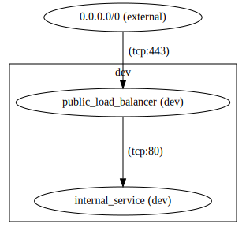

# Cloudless

Cloudless makes it easier to interact with cloud resources by doing most of the
work that a human doesn't need to care about for you, and by being transparent
about what it's doing.

- [Homepage](https://getcloudless.com)
- [Documentation](https://docs.getcloudless.com)
- [Github](https://github.com/getcloudless/cloudless)

## Installation

This project depends on [Python
3.6.0](https://www.python.org/downloads/release/python-360/) or greater.  To
install, run:

```shell
pip3 install cloudless
```

## Quick Start

These examples show how to quickly create a simple service that is accessible on
port 80 in Google Compute Engine and in Amazon Web Services.  Run any command
with `--help` for more usage.

### Google Compute Engine Credentials

To set up the Google Compute Engine client, you must first create your Google
Compute Engine account and navigate to
[https://console.cloud.google.com/iam-admin/serviceaccounts](https://console.cloud.google.com/iam-admin/serviceaccounts).
There you can select your project and create a service account.  Remember the
service account email and create a key for this service account.  Download and
save this key on your local machine, remembering the path.

You will also need the project ID (not the project name).  Go to
[https://console.cloud.google.com/iam-admin/settings/project](https://console.cloud.google.com/iam-admin/settings/project)
and select your project to find your project ID.  When you think you have
everything, run:

```shell
cldls init --provider gce
cldls network list
```

This will set the "default" profile to use the "gce" backend.  You can change
the profile by passing `--profile` to cloudless or setting the
`CLOUDLESS_PROFILE` environment variable.  See [Profiles](#profiles) for more information.

### Amazon Web Services Credentials

To set up the Amazon Web Services client, follow the steps at
[https://docs.aws.amazon.com/cli/latest/userguide/cli-chap-getting-started.html](https://docs.aws.amazon.com/cli/latest/userguide/cli-chap-getting-started.html)
to configure the aws cli.  Currently, cloudless only uses the "default" aws
profile that is configured in this way.  After you set up a default profile that
works with the AWS cli, everything in cloudless should work.  When you think you
have this working, run:

```
cldls init --provider aws
cldls network list
```

This will set the "default" profile to use the "aws" backend.  You can change
the profile by passing `--profile` to cloudless or setting the
`CLOUDLESS_PROFILE` environment variable.  See [Profiles](#profiles) for more information.

### Simple Service

The next steps are identical regardless of which cloud provider you're using.
They do assume you have an image named "cloudless-example-base-image-v0" with
Ubuntu 16.04 installed on it in your provider.  See the [Image
Builder](#image-builder) section for how to build an image like this using
Cloudless.

Once you have the prerequisites, you can create your service with:

```shell
cldls network create mynet examples/network/blueprint.yml
cldls service create mynet myservice examples/apache/blueprint.yml
cldls paths allow_network_block mynet myservice 0.0.0.0/0 80
cldls service get mynet myservice
# Navigate to the "public_ip" of each instance in a browser to see the service.
```

### Command Line Autocomplete

Since this project uses [click](https://click.palletsprojects.com/en/7.x/),
autocomplete is built in.  Just follow
[https://click.palletsprojects.com/en/5.x/bashcomplete/](https://click.palletsprojects.com/en/5.x/bashcomplete/)
if you use bash or
[https://github.com/click-contrib/click-completion](https://github.com/click-contrib/click-completion)
for other shells.

For example, for bash puth this in your .bashrc:

```shell
eval "$(_CLDLS_COMPLETE=source cldls)"
```

## Profiles

Both the API and the command line support using profiles that are created with `cldls init`.  The
order of priority for loading profiles is:

1. Explicitly set via the `profile` argument to `cloudless.Client` in the python api, or via the
   `--profile` option to the `cldls` command line.
2. Set in the `CLOUDLESS_PROFILE` environment variable.
3. `"default"`

## Client Setup In Python API

In the Python API, you must create a client object to connect to the cloud
platform that you'll be working with.  The client handles authentication with
the cloud provider, so you must pass it the name of the provider and the
authentication credentials.

If you are trying this project for the first time, it's recommended that you use
the "mock-aws" client.

### Google Compute Engine Client

To use the Google Compute Engine client, you must create a service account and
download the credentials locally.  Because this provider is implemented using
[Apache Libcloud](https://libcloud.apache.org/), you can refer to the [Google
Compute Engine Driver
Setup](https://libcloud.readthedocs.io/en/latest/compute/drivers/gce.html#getting-driver-with-service-account-authentication)
documentation in that project for more details.

When you have the credentials, you can do something like this, preferably in a
dotfile you don't commit to version control.  Note the credentials file is in
JSON format:

```shell
export CLOUDLESS_GCE_USER_ID="sverch-cloudless@cloudless-000000.iam.gserviceaccount.com"
export CLOUDLESS_GCE_CREDENTIALS_PATH="/home/sverch/.gce/credentials.json"
export CLOUDLESS_GCE_PROJECT_NAME="cloudless-000000"
```

Then, you can run these commands in a python shell to create a GCE client:

```python
import cloudless
import os
client = cloudless.Client("gce", credentials={
    "user_id": os.environ['CLOUDLESS_GCE_USER_ID'],
    "key": os.environ['CLOUDLESS_GCE_CREDENTIALS_PATH'],
    "project": os.environ['CLOUDLESS_GCE_PROJECT_NAME']})
```

If you want to avoid having to pass all this configuration explicitly to the client object, you can
use a [Cloudless Profile](#profiles).

### Amazon Web Services Client

Currently no credentials can be passed in as arguments for the AWS provider
(they are ignored).  However this provider is implemented with
[Boto](http://docs.pythonboto.org/en/latest/), which looks in many other places
for the credentials, so you can configure them in other ways.  See the [boto3
credential setup
documentation](https://boto3.readthedocs.io/en/latest/guide/configuration.html)
for more details.

Once you have set up your credentials, you can run the following to create an AWS client that uses
the "default" aws profile (if you pass an empty credentials object, this cloudless profile will use
whatever the `AWS_PROFILE` environment variable is set to, which might be confusing):

```python
import cloudless
client = cloudless.Client("aws", credentials={"profile": "default"})
```

If you want to avoid having to pass all this configuration explicitly to the client object, you can
use a [Cloudless Profile](#profiles).

### Mock Amazon Web Services Client

The Mock AWS client is for demonstration and testing.  Since it is all running
locally, you don't need any credentials.  Simply run:

```python
import cloudless
client = cloudless.Client("mock-aws", credentials={})
```

## Architecture

There are only three objects in Cloudless: A Network, a Service, and a Path.  This
is an example that shows a Network `dev`, a `public_load_balancer` Service, an
`internal_service` Service, a Path from the internet to `public_load_balancer`
on port 443, and a Path from `public_load_balancer` to `internal_service` on
port 80.  See the [visualization](#visualization) section for how to generate
this graph.



### Network

A Network is the top level container for everything else.  To create a new
network, run:

```python
dev_network = client.network.create("dev")
```

This will return the "Network" object that describes the network that was
created.  You can retrieve an existing network or list all existing networks by
running:

```python
dev_network = client.network.get("dev")
all_networks = client.network.list()
```

Finally, to destroy a network:

```python
client.network.destroy(dev_network)
```

Create should use sane defaults, but if you need to do something special see
[docs/network-configuration.md](docs/network-configuration.md).

In [ipython](https://ipython.org/), you can run `<object>?` to [get help on any
object](https://ipython.readthedocs.io/en/stable/interactive/python-ipython-diff.html#accessing-help),
for example `client.network.create?`.

### Service

A Service a logical group of instances and whatever resources are needed to
support them (subnetworks, firewalls, etc.).

To create a Service, you must first define a configuration file called a
"blueprint" that specifies how the service should be configured.  This is an
example of what a Service blueprint might look like:

```yaml
---
network:
  subnetwork_max_instance_count: 768

placement:
  availability_zones: 3

instance:
  public_ip: True
  memory: 4GB
  cpus: 1
  gpu: false
  disks:
    - size: 8GB
      type: standard
      device_name: /dev/sda1

image:
  name: "ubuntu/images/hvm-ssd/ubuntu-xenial-16.04-amd64-server-*"

initialization:
  - path: "haproxy-cloud-config.yml"
    vars:
      PrivateIps:
        required: true
```

The "network" section tells Cloudless to create subnetworks for this service big
enough for 768 instances.

The "placement" section tells Cloudless to ensure instances in this service are
provisioned across three availaibility zones (which most cloud providers
guarantee are meaningfully isolated from each other for resilience).

The "instance" section describes the resource reqirements of each instance.
Cloudless will automatically choose a instance type that meets these requirements.

The "image" section represents the name of the image you want your instances to
have.  In this case, we are using an image name only found in AWS by default, so
this example will only work there.  See `examples/apache` for a blueprint that
works cross cloud because it uses a custom image.

The "initialization" section describes startup scripts that you want to run when
the instance boots.  You may also pass in variables, which will get passed to
the given file as [jinja2](http://jinja.pocoo.org/) template arguments.  This is
a good place to specify environment specific configuration, so your base image
can stay the same across environments.

Once you have the blueprint, the example below shows how you could use it.
These examples create a group of private instances and then create some HAProxy
instances in front of those instances to balance load.  Note that many commands
take `dev_network` as the first argument.  That's the same network object
returned by the network commands shown above.  These assume you have created the
base image in `examples/base-image` on the provider you are using.

```python
internal_service = client.service.create(dev_network, "private",
                                         blueprint="examples/nginx/blueprint.yml")
private_ips = [instance.private_ip for instance in client.service.get_instances(internal_service)]
load_balancer_service = client.service.create(dev_network, "public",
                                              blueprint="examples/haproxy/blueprint.yml",
                                              template_vars={"PrivateIps": private_ips})
internal_service = client.service.get(dev_network, "public")
load_balancer_service client.service.get(dev_network, "private")
client.service.list()
client.service.destroy(internal_service)
client.service.destroy(load_balancer_service)
```

### Path

The Path is how you tell Cloudless that two services should be able to communicate.
No blueprint is needed for this, but you need to have the service objects you
created earlier.  This example adds a path from the load balancer to the
internal service on port 80 and makes the load balancer internet accessible on
port 443:

```python
from cloudless.types.networking import CidrBlock
internet = CidrBlock("0.0.0.0/0")
client.paths.add(load_balancer_service, internal_service, 80)
client.paths.add(internet, load_balancer_service, 443)
```

You can check whether things have access to other things or print out all paths
with the following functions:

```python
client.paths.has_access(load_balancer_service, internal_service, 80)
client.paths.internet_accessible(load_balancer_service, 443)
client.paths.internet_accessible(internal_service, 443)
client.paths.list()
print(client.graph())
```

## Visualization

Get a summary in the form of a graphviz compatible dot file by running:

```python
client.graph()
```

To generate the vizualizations, run:

```shell
cd ui && env PROVIDER=<provider> bash graph.sh
```

And open `ui/graph.html` in a browser.  Note this won't work for the `mock-aws`
provider since it will be running in a different process.

## Image Builder

This project provides a cross cloud image builder that depends on the core
cloudless APIs.  this means that for the most part it is completely cloud
independent, mod differences in the image that you start with (so it's
completely independent if you're building your own custom image from scratch).

For this example, we use the Ubuntu image provided by the cloud provider, so we
have different blueprints for AWS and GCE (because the standard Ubuntu images
they provide have different names).

First, to deploy a service running a single instance:

```shell
$ cldls --profile gce image-build deploy examples/base-image/gce_image_build_configuration.yml
```

Next, to run the configure script.  This is a shellscript that cloudless will
pass the login credentials to as arguments, and where you can run your
configuration as code scripts:

```shell
$ cldls --profile gce image-build configure examples/base-image/gce_image_build_configuration.yml
```

Next, to run the check script.  This is another shellscript that cloudless will
pass the login credentials to as arguments, and where you can run your
validation to make sure the configuration step worked as expected:

```shell
$ cldls --profile gce image-build check examples/base-image/gce_image_build_configuration.yml
```

Finally, when you have your scripts working as you want them to, run a cleanup
in preparation for a full build.  Saving images without a full build is not
supported to discourage modifications that are made on the machine and not
recorded in scripts anywhere making it into the image:

```shell
$ cldls --profile gce image-build cleanup examples/base-image/gce_image_build_configuration.yml
```

Now, run the full build end to end, and you have your new image!

```shell
$ cldls --profile gce image-build run examples/base-image/gce_image_build_configuration.yml
```

We can list the image with:

```shell
$ cldls --profile gce image list
Image Name: cloudless-example-base-image-v0
Image Id: ami-0d7366265fcccbe46
Image Created At: 2018-09-20T16:51:03.000Z
```

Get it by name with:

```shell
$ cldls --profile gce image get cloudless-example-base-image-v0
Image Name: cloudless-example-base-image-v0
Image Id: ami-0d7366265fcccbe46
Image Created At: 2018-09-20T16:51:03.000Z
```

And finally, delete the image.  You might want to wait on this step because the
[Service Tester](#service-tester) step below uses this image:

```shell
$ cldls --profile gce image delete cloudless-example-base-image-v0
Deleted image: cloudless-example-base-image-v0
```

See [examples/base-image](examples/base-image) for examples of how to create a
cross cloud base image using this framework.

## Service Tester

This project also provides a framework to help test that blueprint files work as
expected.  The framework will create, verify, and clean up the service under
test.  It also spins up all dependent services so you can test services "in
context".  It's sort of a hybrid between a unit test and an integration test.

These examples assume the profile you have configured has an image that was
built using the [Image Builder](#image-builder) step above.  If you've followed
those steps, these instructions are completely identical regardless of whether
you're using AWS or GCE.

First, to create the service:

```shell
$ cldls service-test deploy examples/apache/service_test_configuration.yml
Creation complete!
To log in, run:
ssh -i examples/apache/id_rsa_test cloudless_service_test@35.237.12.140
$ ssh -i examples/apache/id_rsa_test cloudless_service_test@35.237.12.140
...
...

Ubuntu comes with ABSOLUTELY NO WARRANTY, to the extent permitted by
applicable law.

cloudless@test-network-jmeiwknbsg-test-service-hswonxmeda-0:~$ 
```

This will create a temporary network to sandbox the test.  Now, to verify that
the service is behaving as expected:

```shell
$ cldls service-test check examples/apache/service_test_configuration.yml
INFO:cloudless.providers.gce:Discovering subnetwork test-network-jmeiwknbsg, test-service-hswonxmeda
INFO:cloudless.util:Attempt number: 1
INFO:cloudless.util:Check successful!
Check complete!
To log in, run:
ssh -i examples/apache/id_rsa_test cloudless@35.237.12.140
```

Finally, to clean up everything:

```shell
$ cldls service-test cleanup examples/apache/service_test_configuration.yml
```

If you want to run all the previous steps all together, you can run:

```shell
$ cldls service-test run examples/apache/service_test_configuration.yml
```

See [examples](examples) for examples of how to set up a blueprint to be
testable with this framework.

## Testing

To run the local tests run:

```shell
pipenv install --dev
tox
```

To run tests against GCE and AWS, run:

```shell
tox -e gce
tox -e aws
```

These will use the `gce-cloudless-test` and `aws-cloudless-test` cloudless
profiles respectively.  See [Profiles](#profiles) for more information.
