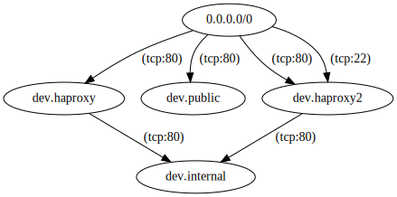

# Visual Graph Interface

This is a very simple example of how a graph interface might look.  Run
graph.sh, and then open graph.html in a browser.  Nothing will show up unless
you have instances and paths in your deployment, as this will call
"client.paths.graph()".

The `graph-example.svg` file shows an example of the svg file that would be
generated.

This is what it looks like:

